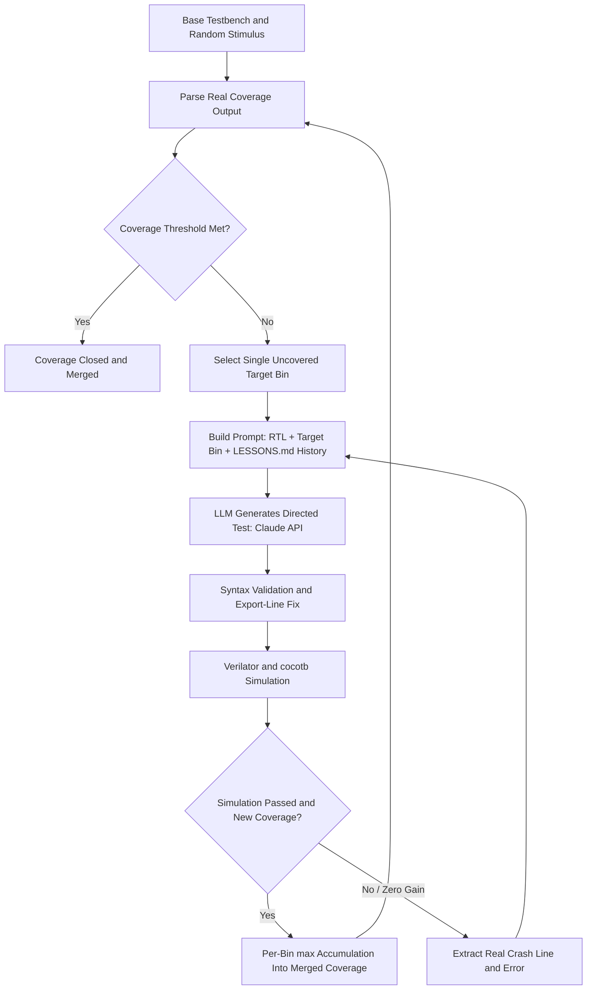

# LLM-Driven Functional Coverage Closure for Hardware Verification: A Research and Implementation Report

**Author:** Venkata Krishna Kumar Vedantam

**Project:** AMBU-CovAgent

> **Scope note:** This report covers v2.2 through v2.10.3.1 — the
> LLM-driven coverage closure agent and its supporting reactive
> scoreboard monitor (Phase 1). A later, separate exploratory pipeline
> for independently re-checking each LLM-generated directed test's data
> integrity is outside this report's scope.

---

## Abstract

Functional coverage closure is a well-documented bottleneck in hardware
verification, reported to consume 60–70% of total engineering effort across
ASIC and FPGA projects. This project built and iteratively hardened an
LLM-driven agent that closes functional coverage gaps for an async FIFO
design (and, to prove generality, two additional designs — a UART
transmitter and an AHB2APB bridge) by generating targeted cocotb directed
tests against real RTL. Across nine documented development checkpoints, a
substantial number of distinct real bugs were found and root-caused —
spanning a Makefile
module-priority conflict, a stdout/stderr capture gap, a coverage-export
timing race specific to how Python executes module-level code, a coverage
accumulator regression, and a genuine clock-domain-crossing hardware bug
uncovered by a newly built reactive scoreboard monitor. Each fix is
documented here with its root cause, its verification evidence, and — where
applicable — the published research that informed the fix. The final
verified state of this version closes functional coverage to 100% on all
three supported designs, with zero data-integrity failures observed in the
base testbenches' own random stimulus. A significant, honestly-documented
limitation of this version is stated plainly: the correctness of the LLM's
own generated directed-test stimulus is not independently verified within
this version's pipeline — coverage closure and base-stimulus data integrity
are proven; directed-test data integrity is not, and this gap is identified
explicitly as the motivation for later work outside this report's scope.

---

## 1. Introduction

### 1.1 The problem

Functional verification remains the dominant cost center in modern chip
development. According to the Wilson Research Group's biennial functional
verification study, verification activities consume between 60-70% of
total project engineering hours across ASIC and FPGA designs alike. Within
verification, achieving 100% functional coverage — proving that every
architecturally significant state of a design has been exercised — is
itself a well-known long tail: the easy 80-90% of coverage bins are often
reached quickly by constrained-random stimulus, while the remaining hard
bins (reset-timing corners, simultaneous boundary conditions, rare
clock-domain-crossing states) can consume disproportionate engineering time
to close by hand.

### 1.2 Where this fits in the current field

This is not a hypothetical exercise. As of 2026, LLM-driven, agentic
coverage closure is an active, funded, and published direction across both
industry and academia:

- **Moores Lab AI** announced CoverageAgent, a new AI-powered solution
  designed to automate coverage closure, built on a platform (VerifAgent)
  already deployed across 15 semiconductor companies, unveiled at DAC 2026.
- A peer-reviewed paper from **Infineon and the National Institute of
  Technology Jalandhar** (arXiv 2603.03147, March 2026) presents an agentic
  AI-driven workflow that utilizes Large Language Model (LLM)-enabled
  Generative AI to automate coverage analysis for formal verification,
  identify coverage gaps, and generate the required formal properties.
- **Synopsys's VSO.ai** provides AI/ML-driven coverage-and-bug-discovery
  tooling, with Intel engineers presenting real production results at SNUG
  Silicon Valley 2026.
- **ChipAgents** explicitly names coverage closure as one of the automatable
  verification bottlenecks its tooling targets.

### 1.3 What this project set out to prove

Given real RTL, could an LLM agent — with no hand-written stimulus —
autonomously close the same hard coverage bins that previously required a
human engineer's manual reasoning about clock-domain-crossing timing? And
could this generalize beyond one design, to different protocols with
completely different signal names and timing models, using the same
unmodified agent code?

---

## 2. Background

### 2.1 Framework and tooling

This project uses **cocotb**, described in its own official documentation
as a COroutine based COsimulation TestBench environment for verifying
VHDL and SystemVerilog RTL using Python, paired with **Verilator**, an
open-source RTL simulator. All three RTL designs used in this project are
written in genuine SystemVerilog (confirmed via direct inspection —
`logic` types, `always_ff`/`always_comb` blocks are present throughout the
active RTL files), not plain Verilog saved with a `.sv` extension.

### 2.2 UVM's scoreboard/coverage-collector separation

A design principle adopted throughout this project, confirmed via the
Doulos UVM methodology reference and the official UVM 1.2 User's Guide: a
scoreboard performs only data-integrity checking — comparing actual DUT
output against expected values — while tracking *which states occurred* is
a separate concern, handled by a coverage collector. A real, independently
published FIFO-UVM verification project's own documented checker split
confirms the same principle directly: the scoreboard does only data
integrity checking. This separation directly informed how this project's
reactive scoreboard monitor (Section 4.8) was scoped.

### 2.3 Industry philosophy on trusting LLM output

At DAC 2026, Intel's own panel commentary on agentic verification
summarized the emerging industry consensus directly: portable stimulus
paired with machine learning driving coverage closure... the panel's
consensus: let the LLM give hints; let the engineer decide. Cadence's own
engineer, at the same event, added: some things are just better done by
yourself... for other tasks an LLM can work wonders, but there is a
tradeoff. This project's own architecture — an LLM proposes stimulus, but
its coverage claims are independently re-parsed from real simulation
output rather than trusted from the LLM's own report — reflects this same
principle, arrived at independently through this project's own development
history (Section 4) before this specific industry framing was found and
compared against it.

---

## 3. Methodology / Architecture

The system's core loop, unchanged in its fundamental shape since v2.3 and
hardened significantly since:

1. A base testbench drives constrained-random stimulus against the RTL,
   establishing a starting functional coverage percentage.
2. The agent identifies uncovered bins from the real, parsed coverage
   output — never from the LLM's own self-report.
3. A prompt is built containing the relevant RTL source, the uncovered
   bins, and (since v2.5) a single primary target bin for this iteration,
   plus any accumulated lessons from prior failed attempts.
4. The LLM (Claude) generates a directed cocotb test.
5. The generated code is syntax-validated and cleaned of known
   LLM-generated artifacts (see Sections 4.1, 4.3, and 4.5 for the
   specific fixes that hardened this step over time), and executed
   against the real RTL via Verilator.
6. Real coverage output is re-parsed; if the target bin(s) were closed,
   the result is accumulated (Section 4.4) into a running merged coverage
   picture.
7. The loop repeats, up to a configured iteration limit, until a coverage
   threshold is met with zero reported data failures, or the limit is
   reached.

This same, unmodified agent code was proven to generalize across three
architecturally distinct designs (async FIFO, UART TX, AHB2APB bridge)
with zero hardcoded signal names, bin names, or design-specific logic —
confirmed via the project's own recurring zero-hardcoding grep checks at
each checkpoint.

*Note on the "Syntax Validation and Export-Line Fix" step: this uses
simple line-based text filtering (removing any zero-indent export line)
followed by `ast.parse()` for syntax validation only — it does not
perform structural AST-based code rewriting. A more sophisticated,
genuinely AST-based code-transformation approach was built later, for a
separate, out-of-scope piece of work, and should not be conflated with
this version's simpler mechanism.*

---

## 4. Findings — Chronological Bottlenecks, Root Causes, and Fixes

### 4.1 v2.2 → v2.3: From manual fix to first fully automatic run

**Baseline:** v2.2 closed the FIFO's three hardest coverage bins by hand,
via a manually written directed test targeting exact CDC reset timing
windows.

**Bottleneck:** The agent's first attempts at closing these same bins
automatically failed silently, with no informative error feedback across
repeated attempts.

**Root causes, both confirmed by direct code inspection:**
1. The project's Makefile hardcoded `MODULE=tb.tb_fifo`. cocotb's own make
   rules give command-line `MODULE=` assignments priority over the
   `COCOTB_TEST_MODULES` variable the agent was setting — meaning the
   agent's own directed test was silently never executed; the base test
   ran instead, every iteration.
2. cocotb routes test output, including Python `RuntimeError` tracebacks,
   to **stdout**, not stderr. The agent's simulation-running function only
   captured stderr, so the LLM never received real error feedback and kept
   regenerating the same broken code blind.

**Fix:** Pass `MODULE={module}` directly on the make command line
(command-line assignments override Makefile defaults in GNU Make); capture
stdout and stderr combined.

**Result:** Merged coverage went from 91.7% to 100.0% in 3 iterations, with
the same 3 bins v2.2 had solved by hand now closed entirely by the agent —
`cx_full_empty[(1,1)]`, `cx_rrst_ren[(0,1)]`, `cx_wrst_wen[(0,1)]`.

### 4.2 v2.5: Production hardening

Nine changes were made, the most significant for this report's purposes:

**Single-bin targeting.** Rather than presenting the LLM with the full list
of uncovered bins every iteration, each iteration explicitly names one
primary target, cycling through the list. This design decision has direct,
strong research backing found and confirmed during this project's own
research process: Meta's own published production research on LLM-driven
test generation at industrial scale (FSE 2025 / arXiv 2501.12862) found
that a tool targeting *specific* objects (mutants)
achieved a 15% fault-kill rate versus 2.4% for a generic, untargeted
coverage-maximizing tool — a roughly 6x difference, measured on real
production systems (Meta's own Messenger, Instagram, and WhatsApp
codebases). The paper's own stated reasoning is directly applicable here:
targeting coverage will be inadequate to kill mutants... this is because
[the targeted tool] specifically targets the mutants, whereas [the
generic tool] does not.

**LESSONS.md.** Persistent, cross-iteration memory — the agent writes down
what failed and reads its own past failures back into the next prompt.
Verified with real, timestamped evidence: early entries in one real run
read only "Avoid: sim failed" (giving no usable signal across 24+ repeated
failures); later entries, after this fix, correctly cite the exact
crashing source line and code.

**Token/cost tracking, including confirming prompt caching.** Tracking was
added after every API call specifically to confirm whether the underlying
API's prompt-caching mechanism was actually being triggered — a monitoring
and confirmation step, not a separate caching implementation built from
scratch.

**Exact crash-line injection.** The error-extraction logic parses the
cocotb traceback, finds the corresponding line number in the agent's own
generated test file, and prepends the literal crashing source line to the
feedback sent to the API on the next attempt.

### 4.3 v2.6 → v2.7: Generalizing beyond one design

**v2.6 — UART TX, a deliberate reusability experiment.** Under a strict
rule (never modify `agent.py`, only add new files under a new design
directory), the framework was pointed at a second, completely different
RTL design. Result: 18/18 bins, 100% coverage, with 2 bins
(`cx_en_busy[(1,1)]`, `cx_rst_en[(0,1)]`) closed by the agent specifically.

**A generalization finding, not just a repeat result:** the same class of
coverage-export timing bug already identified as a real problem for the
FIFO design reappeared here, independently, on completely different RTL
with different signal names and a different protocol — real evidence the
underlying bug is generic to how an LLM uses the cocotb-coverage library
under Python's own import-time execution model, not specific to any one
design's RTL. This design's own fix at this point in time was a per-design
workaround (an `atexit` handler re-exporting real coverage after the test
completes); the permanent, general fix inside the agent's own code came
one checkpoint later (v2.7, below) and required no per-design workaround
in any future design.

**v2.7 — the permanent fix.** A one-line change moved the LLM's
coverage-export call from being potentially placed at module scope to
being correctly placed inside the test function body, replacing a
per-design `atexit`-handler workaround that had been used as a stopgap in
v2.6.

### 4.4 v2.9: The coverage accumulator regression ("Bug #1")

**Bottleneck, observed live, twice, in GitHub Codespaces:** merged
coverage could decrease mid-run. A bin proven reachable in iteration 3
would disappear from the merged result in iteration 4 — a live drop from
97.2% to 91.7%, logged directly: `[ITER-6][MERGE] 97.2% → 91.7%
(Δ−8.3%)`.

**Root cause:** the variable holding directed-test results was reassigned
from only the *most recent* successful iteration's coverage file, every
iteration — with no mechanism remembering what earlier iterations had
already proven. A later iteration that didn't happen to re-exercise an
earlier iteration's hard-won bin caused that bin to silently revert to
zero in the merged report.

**Fix:** introduced a persistent accumulator dictionary, updated after
every successful iteration using **per-bin `max()`** — never decreasing.

**Why `max()` and not `sum()`:** `sum()` would double-count identical
re-exercised hits across iterations, falsely implying more evidence than
exists; `max()` correctly answers the actual question functional coverage
is meant to answer — has this bin *ever* been proven reachable.

**Research grounding for this specific design choice, three independent
sources:**
- The Accellera UCIS 1.0 standard (June 2012) defines coverage-database
  merge semantics as union-based: UCIS allows users to analyze, grade,
  merge and report coverage from one or more databases from one or more
  tool vendors — a bin proven hit in any run remains credited regardless
  of later runs.
- Elitism in evolutionary algorithms: elitism explicitly preserves the
  highest-performing solutions across generations, ensuring their direct
  contribution to subsequent populations (ACM CISAI 2025) — directly
  analogous, treating each iteration's directed test as one generation of
  stimulus.
- The AFL/libFuzzer coverage-guided fuzzing corpus model: when a
  particular program input results in increased code coverage, [the]
  fuzzer stores this input in a seed cache for future use — the same
  underlying principle of permanently preserving any proven improvement.

**Verification:** re-tested across all three designs with a clean
`LESSONS.md`, all three histories confirmed monotonically non-decreasing,
with zero regressions observed across the re-verification runs.

**An important, honestly-documented architectural consequence of this
fix, sometimes called the "accumulator gap":** because the fix
accumulates per-bin *hit counts* across iterations, not the underlying
*source code* of each iteration, the agent's live-reported 100% merged
coverage is a genuine union across the memory of multiple iterations —
but any *single* saved directed-test file, run standalone after the fact,
may reproduce a lower percentage (observed directly: 97.22%, missing one
specific bin an earlier, no-longer-saved iteration had proven). This is
correct, honest behavior consistent with the fix's own design — the
accumulator was built to remember coverage *evidence*, not to preserve
every iteration's literal code — but it is a real characteristic worth
stating plainly rather than leaving implicit.

### 4.5 v2.10: The export-placement fix

**Bottleneck, platform-specific:** on GitHub Codespaces (x86_64) — but not
on Mac (ARM64) — every successful simulation showed exactly 0% coverage
gain.

**Root cause, confirmed directly by inspecting the actual generated file:**
the LLM occasionally placed `coverage_db.export_to_yaml()` at zero
indentation, outside the test function. Python executes module-level code
at *import time*, before any test function runs — so the export fired
immediately with zero real hits recorded, and the real coverage data
accumulated later during the actual test run was never re-exported.
Traced specifically to Codespaces producing longer LLM-generated files
(250+ lines, for the harder CDC bins) in which a prompt instruction meant
to indicate "the last line inside the function" was apparently
interpreted as "the last line of the file."

**Fix:** the code-cleaning step strips any zero-indent export line before
syntax validation; a correctly-indented version is then injected back
inside the function body.

### 4.6 v2.10.1: Operational fixes

An unconditional 60-second sleep after every iteration (added originally
as a blanket buffer against API rate limits) was reduced to 2 seconds,
since the agent already has explicit, conditional retry logic specifically
for real HTTP 429 rate-limit responses — the blanket sleep was redundant.
Separately, a Codespaces devcontainer setup script referenced an
Ubuntu-only package that does not exist on Debian Trixie (Codespaces'
actual base image), causing every fresh Codespace to fail to build
automatically; removing the dependency made the repository build
correctly with zero manual intervention.

### 4.7 v2.10.2: Scoreboard data-integrity fixes and fault-injection validation

Two real, independent gaps were found and fixed in the project's
deterministic (fixed-sequence) scoreboards:

- **UART TX:** the scoreboard verified only that the TX line correctly
  went low for the start bit and returned high afterward — the 8 data
  bits transmitted in between were never sampled or compared. A DUT
  transmitting fully inverted data would have passed undetected. Fixed by
  sampling all 8 data bits plus the stop bit at the timing midpoint of
  each bit period, with the exact timing derived directly from the RTL's
  own clock-rate parameters.
- **AHB2APB:** the scoreboard verified address and slave-select signals
  during write transactions but never checked the actual write-data bus.
  A bridge that correctly routed the address but zeroed the data payload
  would have passed undetected. Fixed by sampling the write-data bus at
  the correct protocol phase, confirmed against both the RTL's own
  registered-output timing and the AMBA APB specification.

**Validation methodology — mutation testing:** to prove these (and the
FIFO's own existing) scoreboards genuinely detect corruption rather than
passing regardless of correctness, 14 deliberate faults were injected
across all three designs (bit flips, full inversions, sequence reversals,
phantom writes, timing violations, stuck-at faults, off-by-one errors).
All 14 were correctly caught, confirming the scoreboards' real
discriminating power rather than assuming it.

### 4.8 v2.10.3: The reactive scoreboard monitor and a real hardware bug

**What was built:** a passive monitor, watching the DUT's real signals in
real time via cocotb's coroutine-based concurrency model, checking data
correctness *during whatever stimulus is actually being driven* — as
opposed to the existing fixed-sequence scoreboard, which only ever checks
a separate, hand-written sequence, run in its own isolated simulation.

**Important scope clarification, stated precisely because it matters for
this report's overall honesty:** in this version, the reactive monitor is
wired into the **base testbench only**. It is not part of the agent's
automatic per-iteration pipeline for the LLM's own directed test — see
Section 6 for the full, explicit discussion of this limitation.

**The bottleneck this surfaced, immediately, on first use — a real,
previously invisible RTL bug:** pointing the new monitor at the base
testbench's actual random stimulus found a genuine clock-domain-crossing
bug that had been present, silently, for 50+ days of prior verification:
the read-enable signal was being driven from the *write* clock's timing
loop, while the FIFO's actual read logic is clocked by the independent,
different-period read clock — allowing the read-enable signal to drift
unpredictably across real read-clock edges, causing the DUT to
occasionally perform spurious extra reads.

**Why the pre-existing fixed-sequence scoreboard never caught this:** it
never drives concurrent writes and reads at all — its own hand-written
sequence always fully separates them (write everything, wait, then read
everything). This is the concrete, empirically demonstrated justification
for building a reactive monitor architecture in the first place: a
monitor watching genuinely concurrent, realistic stimulus can catch bug
classes a fixed, artificially-separated sequence architecturally cannot.

**The fix — four adversarially-audited rounds, each independently
verified against real Verilator output:**

1. Split the single write-clock-timed stimulus loop into two independent
   coroutines — write-related signals on the write clock, read-enable on
   its own, correctly-clocked read-clock-timed coroutine.
2. Found and fixed a second, distinct bug in the monitor's own logic: a
   DUT output that is itself a *registered* signal must be sampled using
   its value from the *previous* clock edge, not the current one, to
   correctly match the RTL's own internal gating condition.
3. Removed an unnecessary, over-engineered synchronization-delay
   approximation after recognizing the DUT's own real status flag already
   *is* the true hardware synchronization boundary the monitor needs.
4. Found the actual remaining root cause: a same-edge race between the
   stimulus-driving coroutine and the passive monitor at the exact moment
   a simulation phase ends. A hard, external cancellation of the
   stimulus-driving coroutine could occur *after* its final random
   decision had already been cached by the monitor's own one-edge
   look-ahead bookkeeping, but *before* the real edge that decision was
   meant to govern — leaving a stale, uncommitted expectation. Fixed by
   replacing hard cancellation with a cooperative stop signal: the
   stimulus coroutine checks for the stop request immediately after each
   real clock edge, before drawing any new random decision, and writes a
   deliberate, correctly-timed final value if asked to stop — keeping the
   monitor's cached expectation always consistent with what actually
   governs the next edge.

**Verification:** 12 independent random seeds (including the exact 3 that
had failed every prior round) showed zero scoreboard failures. A separate,
one-time developer verification — run specifically to stress-test the
*monitor's own correctness* against more complex, realistic stimulus
shapes than the base testbench alone provides — pointed the monitor at one
real LLM-generated directed test and observed 463 out of 463 checks
passing. This result demonstrates the monitor mechanism itself functions
correctly on directed-test-shaped stimulus; it was a one-time verification
of the tool, not a standing, automatic feature of the per-iteration
pipeline (see Section 6).

### 4.9 v2.10.3.1: The orphan-check fix, and a real process failure

**Bottleneck — a genuine, silent blind spot in the reactive monitor
itself:** when the DUT claimed a valid read was occurring but the
monitor's own internal reference model unexpectedly had nothing recorded
to compare against — a real disagreement between the DUT and the
reference model about whether data should exist — the existing code did
nothing at all: no check performed, no error raised. A real DUT bug, such
as the empty-status flag desynchronizing immediately after reset (a
documented, real risk category for asynchronous FIFO CDC designs), would
have been completely invisible.

**Fix:** added the missing branch — when this specific disagreement
occurs, it is now explicitly logged as a real, countable error. This
pattern is a recognized, named technique in standard scoreboard design
practice — an "orphan check": explicitly comparing whether the reference
model and the real design agree on being empty, and treating disagreement
itself as a finding worth reporting, rather than a case to silently skip.

**Verification:** all previously-tested seeds continued showing zero
errors and zero orphan triggers (confirming no false positives were
introduced); a deliberate positive test, constructing the exact
disagreement condition on purpose, confirmed the new check fires correctly
exactly once; a full 1000-seed regression showed 1000/1000 clean; a
100-seed reassurance check confirmed every run was performing a
genuinely substantial number of real checks (340–370 per run), not merely
staying silent by default.

**A separate, real process failure worth documenting on its own
merits:** during unrelated cleanup work, a broad version-control command
was run across multiple files without first checking whether any
individually held legitimate, unsaved work. The entire four-round CDC fix
from Section 4.8 had never been permanently saved at that point — so the
cleanup command silently reverted it back to its pre-fix state. The loss
was only discovered later, when re-running the base testbench found a
96%+ data-integrity failure rate on a run that should have been clean —
the exact symptom of the original, already-solved bug, resurrected. The
fix was recovered from an independent local backup, confirmed identical
to that backup's own already-published version before being restored, and
re-verified across a fresh 100-seed regression before being trusted
again. **The standing rule adopted as a direct result: any verified fix is
saved permanently, in its own isolated unit, before any other work
touches the same file again** — a real process lesson, not just a
technical one.

---

## 5. Verified Results

All results were independently reproduced with real, live agent runs — not
static code review — across a freshly cloned, independent environment.

| Design Under Test | Base Coverage % | Final Coverage % | LLM Iterations | Base Data Failures | Mutation Faults Caught | Verification-Environment Bugs Found |
| :--- | :--- | :--- | :--- | :--- | :--- | :--- |
| **`async_fifo`** | 91.7% | **100.0%** | 3–4 | 0 | 5 / 5 (100%) | **1 (CDC stimulus-timing bug, in the testbench — not the RTL)** |
| **`uart_tx`** | 88.9% | **100.0%** | 2 | 0 | 4 / 4 (100%) | 0 |
| **`ahb2apb`** | 67.4% | **100.0%** | 4 | 0 | 5 / 5 (100%) | 0 |
| **Overall / Total** | **82.7% (avg)** | **100.0%** | **9–10** | **0** | **14 / 14 (100%)** | **1** |

All three of the FIFO design's hardest, originally unreachable-by-chance
bins were closed by the agent, correctly attributed in the project's own
coverage-attribution reporting, with the base testbench's own random
stimulus independently confirmed data-integrity-clean by the reactive
monitor. The one verification-environment bug found (Section 4.8) was a
real, genuine defect in `tb_fifo.py`'s own stimulus-driving code — the
RTL under test was never modified across any of the four fix rounds and
was not itself found to be defective; this distinction is stated
precisely here to avoid any implication that the design's hardware was
found to be buggy, when in fact the bug was in the code driving the
DUT's inputs.

---

## 6. Discussion — Honest Scope of What Is, and Is Not, Proven

This section exists specifically to prevent this report from implying
more than what was actually built and verified.

**What is proven, with real evidence, in this version:**
- The LLM agent reliably closes real, hard functional coverage gaps
  across three architecturally distinct designs, using the same
  unmodified core logic.
- The *base testbench's* random stimulus is independently, automatically
  verified for data integrity, in real time, every run, via the reactive
  monitor.
- The project's fixed-sequence scoreboards (hand-written, not
  LLM-generated) correctly detect deliberately injected data corruption
  across 14 real fault-injection tests.

**What is explicitly not proven, automatically, by this version's
pipeline:**
- **Whether the LLM's own specific, per-iteration generated stimulus
  itself produces correct data is not automatically checked.** The
  reactive monitor's real-time checking is wired into the base testbench
  only. The one-time, 463/463-check verification described in Section
  4.8 demonstrates the *monitor mechanism itself* is capable of correctly
  checking directed-test-shaped stimulus — but this was a single,
  manual, developer-run verification during the monitor's own
  development, not something that runs automatically as part of every
  agent iteration in this version.
- This means the industry philosophy discussed in Section 2.3 — "let the
  LLM give hints, let the engineer decide," never trusting LLM output
  without independent checking — is embodied by this version for
  *coverage claims* (always independently re-parsed from real simulation
  output) and for the *base stimulus's* data correctness, but is **not
  yet embodied for the correctness of the LLM's own generated stimulus
  specifically.** Closing this specific gap was identified, during this
  project's own development, as valuable future work — explicitly out
  of scope for this report.

---

## 7. Limitations

- **Toolchain choice versus industry baseline.** Current, real 2026 job
  postings for entry-level Design Verification roles (confirmed directly
  from postings at NVIDIA) — and SystemVerilog/UVM requirements confirmed
  as well in real, current postings at Qualcomm and AMD, though at
  senior and internship levels respectively rather than entry-level
  specifically — list SystemVerilog, UVM, and a commercial simulator
  (VCS/Questa/Xcelium) as explicit baseline requirements across the
  industry. This project deliberately used cocotb and Verilator — an
  open-source, Python-native environment — enabling rapid iteration on
  coroutine-based concurrency handling and closed-loop LLM integration.
  This stack demonstrates the underlying verification concepts,
  coverage-closure methodology, and current AI-agent architecture, but
  does not by itself demonstrate SystemVerilog/UVM tool fluency or
  commercial EDA suite experience, and should not be represented as a
  substitute for either.
- **The reactive scoreboard monitor is FIFO-specific in this version.**
  It has not been extended to the UART TX or AHB2APB designs.
- **Directed-test data-integrity verification is not automated in this
  version**, as discussed in full in Section 6.
- **Protocol/timing-boundary correctness** (for example, whether a status
  flag asserts at exactly the correct internal condition, independent of
  data values) is a distinct verification concern from data-integrity
  scoreboarding, per the UVM architectural principle cited in Section
  2.2, and is not addressed by any component described in this report.

---

## 8. Conclusion

Across nine documented checkpoints, this project demonstrates that an
LLM-driven agent — using only real, re-parsed simulation output, never
trusting the LLM's own self-reported success — can reliably close hard
functional coverage gaps across multiple, architecturally distinct RTL
designs, using unmodified, design-agnostic core logic. A substantial
number of real, independently verified bugs were found and fixed along
the way, several with direct grounding in published research (Accellera UCIS, evolutionary-
algorithm elitism, coverage-guided fuzzing corpus retention, and Meta's own
published production research on targeted versus generic LLM test
generation). A newly built reactive scoreboard monitor, motivated directly
by the recognized industry principle that functional coverage alone is
insufficient proof of correctness, itself surfaced a genuine,
previously-undetected hardware bug on first real use — concrete evidence
for the monitor's own architectural justification. This report closes with
an explicit, honest statement of what remains unverified — the
correctness of the LLM's own directed-test stimulus specifically — rather
than allowing the strength of the surrounding results to imply a broader
claim than what was actually built and tested.

---

## References

1. Wilson Research Group / Siemens EDA — Functional Verification Study
   (biennial), cited figure: verification activities consume 60-70% of
   total project engineering hours.
2. Moores Lab AI — CoverageAgent / VerifAgent product announcement, 2026.
3. Infineon & National Institute of Technology Jalandhar — "Agentic
   AI-based Coverage Closure for Formal Verification," arXiv:2603.03147,
   March 2026.
4. Synopsys — VSO.ai coverage-driven verification, SNUG Silicon Valley
   2026 (Intel presentation).
5. Doulos — UVM Coverage-Driven Verification Methodology reference.
6. Accellera Systems Initiative — Universal Coverage Interoperability
   Standard (UCIS) 1.0, June 2012.
7. ACM CISAI 2025 — Elitism in evolutionary algorithms (preservation of
   best-performing solutions across generations).
8. IRFuzzer 2024 / LLVM project documentation — AFL/libFuzzer
   coverage-guided fuzzing corpus retention model.
9. Meta — "TestGen-LLM / ACH: Targeted vs. Generic LLM Test Generation
   at Industrial Scale," FSE 2025 / arXiv:2501.12862. (Author names not
   independently confirmed in this project's own research process —
   cited by venue and identifier only.)
10. DAC 2026 — Panel commentary, Intel and Cadence engineers, on
    LLM-assisted verification and human-in-the-loop review philosophy.
11. cocotb official documentation — coroutine-based co-simulation
    testbench framework description.
