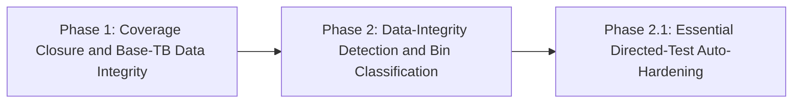
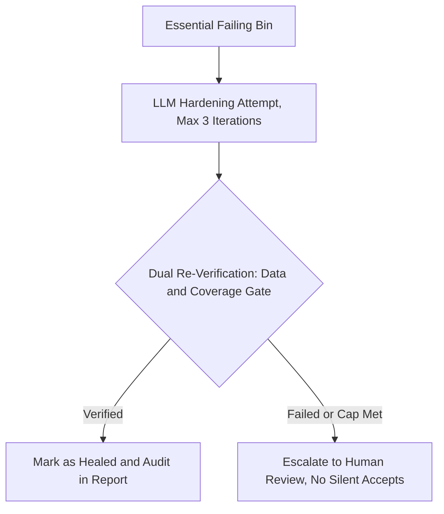

# AMBU-CovAgent — Phase 2 and Phase 2.1: Future Implementation Roadmap

**Author:** Venkata Krishna Kumar Vedantam

**Project:** AMBU-CovAgent

**Status:** Planned / Future Architecture (Phase 1 Complete & Verified)

---

> **Status Note:** Phase 1 (v2.2 through v2.10.3.1) is complete, verified,
> and documented separately in `RESEARCH_AND_IMPLEMENTATION_HISTORY_PHASE1.md`
> / `AMBU-CovAgent_Research_and_Implementation_Report.md`. This document
> describes Phase 2 and Phase 2.1 as planned future work.
>
> Substantial parts of both phases were built and adversarially tested
> during internal development (including real API-driven diagnosis and
> repair of a hardware CDC bug), then deliberately excluded from the
> initial public release to keep the codebase lean and its verification
> claims tightly scoped. This document formally outlines the
> research-grounded plan for resuming that work.

---

## 1. Motivation: Why Phase 2 is Necessary

Phase 1 established full closed-loop functional coverage closure
(100.0%) and verified the data integrity of the base testbench. However,
as noted in the Phase 1 report: **coverage closure proves a state was
reached, but does not independently verify that the LLM's directed test
stimulus preserved data integrity during that state.**

Phase 2 directly closes this gap by establishing an independent
verification and hardening pipeline for LLM-generated stimulus.

---

## 2. Phase 2: Independent Data-Integrity Verification (Detection-Only)

**Goal:** Formally verify every successful directed test generated by
the agent using the reactive scoreboard monitor, reporting failure
states honestly without attempting automatic repair.

**Execution blueprint:**

1. **Isolated artifact storage:** save each coverage-closing directed
   test's source code with a unique, collision-free identifier.
2. **Standalone verification run:** re-execute each saved test
   independently with the passive reactive scoreboard monitor attached,
   to generate an unbiased pass/fail result.
3. **Redundancy and essential triage:**
   - *Redundant failure:* if a coverage bin fails data integrity in
     Test A, but is cleanly proven by Test B, the failure is flagged as
     redundant and set aside.
   - *Essential failure:* if a failing test is the only stimulus that
     reaches a specific coverage bin, it is classified as essential and
     failing, and flagged for review.
4. **Transparent reporting:** produce an audit report detailing clean
   passes, redundant failures (safe to ignore), and essential failures
   (requiring intervention).

**Architectural guardrail:** Phase 2 is detection-only. In alignment
with 2026 industry guidance (Keysight / QASkills), baseline failure
causes must be established and classified before enabling autonomous
repair.

---

## 3. Phase 2.1: LLM-Driven Hardening of Essential Directed Tests

**Goal:** For the specific subset of directed tests classified in Phase
2 as essential and failing, attempt bounded, LLM-driven stimulus
hardening under strict safety constraints.

### Why safeguards are mandatory (the AI test-repair trap)

Enterprise analysis of autonomous self-healing test frameworks in 2026
(Ranorex / Qate AI) revealed significant operational risks when
auto-repair is applied naively:

- **23% higher false positive rates** compared to traditional test
  suites.
- **31% increase in debugging time** spent investigating invalid
  AI-introduced code modifications.
- **60% abandonment rate** within three months when AI features run
  without explicit verification gates.

To avoid these failure modes, Phase 2.1 implements three mandatory
guardrails:

**Mandatory safeguards:**

1. **Always re-verify (never silent accept):** every repair attempt
   generated by the LLM must pass two gates before acceptance —
   complete data integrity (zero scoreboard errors) and coverage
   preservation. An LLM's own claim of success is never trusted without
   real execution proof.
2. **Bounded attempts and human escalation gate:** a hard limit of 3
   attempts. If the LLM cannot produce a verified fix within 3
   iterations, the process halts and escalates the test to explicit
   human review. A visible failure is strictly preferred over a
   low-confidence false positive (Wibisono, 2026).
3. **Full audit trail visibility:** proposed conventions (for example,
   tagging healed tests as `LLM-Healed-AutoVerified` in regression
   reports) ensure all modifications remain queued for human code
   review before permanent merge — this is a proposed naming
   convention for implementation, not yet a decided, shipped feature.

---

## 4. Prior Work and Proven Prototype Baseline

During Phase 1 development, a prototype of the Phase 2.1 hardening loop
was built and tested against a real CDC clock mismatch:

**Test scenario:** a cross-clock-domain (CDC) fault was deliberately
introduced into a dedicated synthetic file
(`_fault_injection_piece5_synthetic.py`) to keep the production base
testbench pristine — the real, shipped `tb_fifo.py` was never modified
for this test.

**Execution result:** the closed-loop agent diagnosed the exact
clock-domain mismatch from the simulation traceback log and fixed it on
**attempt 1** — correctly re-aligning the read-loop trigger from
`RisingEdge(dut.wclk)` to `RisingEdge(dut.rclk)`. The fix was
automatically validated and accepted via the reactive scoreboard
monitor, using the same monitor already proven for Phase 1's base
testbench.

This existing prototype provides a validated starting point to resume
Phase 2 and Phase 2.1 implementation — not a design to be started from a
blank page.

---

## References

1. Ranorex Studio / Qate AI (2026): Enterprise Self-Healing Test
   Automation Deployment Analysis (data on false positives, debug
   overhead, and AI feature retention).
2. Keysight Blogs / QASkills (2026): Self-Healing Test Automation —
   Staged Rollout from Baseline Detection to Autonomous Repair.
3. Tito Irfan Wibisono (2026): Self-Healing Test Automation with
   Playwright and LLMs — A Practical Guide (confidence thresholds,
   action timeouts, and human review gates).
4. AMBU-CovAgent Phase 1 Report (2026): Functional Coverage Closure and
   Passive Scoreboard Verification Baseline.
